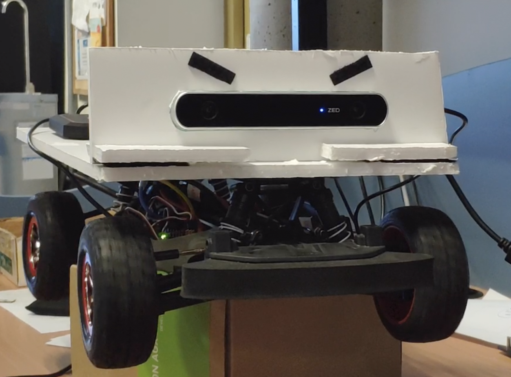

# DepthEstimation project
## Repository for Deep Learning models for depth estimation on autonomous vehicles.

In this project we use CNN algorithms which comes from NVIDIA Redtail project (NVIDIA-AI-IOT/redtail) and a custom version of ros_deep_learning node (theparselmouth/jetson-car). 
In this repository you will find files and instructions for running both algorithms together in an embedded computational platform such as Nvidia Jetson TX2 or Nvidia Jetson Xavier using a ZED camera for stereo vision.

For a detailed explanation on how both algorithms run together and what models had been used for depth estimation, read the MasterThesis.pdf


<p align="center">
  
</p>

<p align="center">
  
</p>

# Installation

This installation guide is a modification of https://github.com/theparselmouth/jetson-car/tree/master/ros_deep_learning#installation. 

## prerequisites

First, install the latest [JetPack](https://developer.nvidia.com/embedded/jetpack) on your Jetson (JetPack 3.3 for TX1/TX2 and JetPack 4.1.1 for Xavier).
Since this repository uses ZED camera for stereo vision, make sure you install the ZED sdk before start this installation guide. https://www.stereolabs.com/developers/

Download gtest library.

```bash
$ sudo apt-get install libgtest-dev
```
If it is already installed, just type the following commands.

```bash
$ cd /usr/src/gtest
$ cmake CMakeLists.txt
$ make
```

Then, build and install [`jetson-inference`](https://github.com/dusty-nv/jetson-inference)
```bash
$ cd ~
$ sudo apt-get install git cmake
$ git clone https://github.com/dusty-nv/jetson-inference
$ cd jetson-inference
$ git submodule update --init
$ mkdir build
$ cd build
$ cmake ../
$ make
$ sudo make install
```
Before proceeding, it's worthwhile to test that `jetson-inference` is working properly on your system by following this step of the Two Days to a Demo tutorial:
* [Running the Image Recognition Program on Jetson](https://github.com/dusty-nv/jetson-inference#using-the-console-program-on-jetson)

## Redtail Project

Now clone the Nvidia Redtail project repository and follow the steps bellow.

```bash
$ cd ~
$ git clone https://github.com/NVIDIA-AI-IOT/redtail.git
$ git clone https://github.com/FaradayDetu/DepthEstimation.git
$ mv DepthEstimation/scripts/*.launch redtail/ros/packages/stereo_dnn_ros/launch
```
 

## ROS

Install the `ros-base` package on your Jetson following these directions:

* TX1/TX2 (ROS Kinetic) - [JetsonHacks Post](https://www.jetsonhacks.com/2018/04/27/robot-operating-system-ros-on-nvidia-jetson-tx-development-kits/)
* Xavier (ROS Melodic) - [ROS Install Instructions](http://wiki.ros.org/melodic/Installation/Ubuntu)

Then, create a Catkin workspace (`~/catkin_ws`) using these steps:

http://wiki.ros.org/ROS/Tutorials/InstallingandConfiguringROSEnvironment#Create_a_ROS_Workspace

Depending on which Jetson you're using, install some additional dependencies:

#### TX1/TX2 (ROS Kinetic)
```bash
$ sudo apt-get install ros-kinetic-image-transport
$ sudo apt-get install ros-kinetic-image-publisher
$ sudo apt-get install ros-kinetic-vision-msgs
```
#### Xavier (ROS Melodic)
```bash
$ sudo apt-get install ros-melodic-image-transport
$ sudo apt-get install ros-melodic-image-publisher
$ sudo apt-get install ros-melodic-vision-msgs
```
## Tensorflow
Ensure you have a version of python 3 in your system. If not follow the installation instructions https://www.python.org/downloads/

```bash
$ pip install virtualenv
$ cd ~
$ virtualenv -p $(which python3) tensorflow
$ source tensorflow/bin/activate
$ pip install catkin_pkg
$ pip install --extra-index-url https://developer.download.nvidia.com/compute/redist/jp33 tensorflow-gpu #if using TX2
$ sudo pip3 install --pre --extra-index-url https://developer.download.nvidia.com/compute/redist/jp/v42 tensorflow-gpu #if   using Xavier
```
## ROS nodes

Next, navigate into your Catkin workspace and clone and build `ros_deep_learning`, `stereoDNN`, `stereo_dnn_ros` and `zed_ros_wrapper`


Note: If you are using Nvidia Jetson Xavier, before process the following commands, substitute the following line in the compilation scripts (compile_first_time.sh, compile_fp32.sh, compile_fp16.sh) 

```bash
cmake -DCMAKE_BUILD_TYPE=Debug/Release .. 
```
by:

```bash
cmake -DCMAKE_BUILD_TYPE=Debug/Release -DCUDA_NVCC_FLAGS='--gpu-architecture=compute_72' .. 
```
In this line, you are specifying the GPU architecture. By default is the architecture corresponding to Jetson TX2, but you can run the application in any CUDA capable device. 

```bash
$ cd ~/catkin_ws/src
$ git clone https://github.com/dusty-nv/ros_deep_learning
$ git clone https://github.com/stereolabs/zed-ros-wrapper.git
$ ln -s ~/redtail/stereoDNN/
$ mv ~/DepthEstimation/scripts/*.sh ~/catkin_ws
$ mv ~/DepthEstimation/ros_deep_learning_src/*.py ~/catkin_ws/src/ros_deep_learning/src
$ cd ../
$ bash compile_first_time.sh
$ catkin_make
```

Once the compilation is done you can compile the TRT code from TF use the different scripts provided using compile_fpXX.sh. Then, you can run all the process with run_inference_fpXX_sh.

For instance:

```bash
$ cd ~/catkin_ws
$ bash compile_fp32.sh
$ bash run_inference_fp32.sh
```


